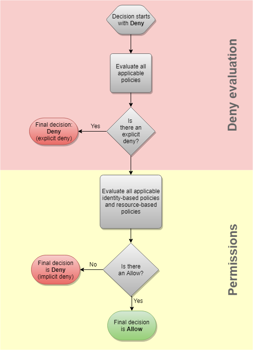
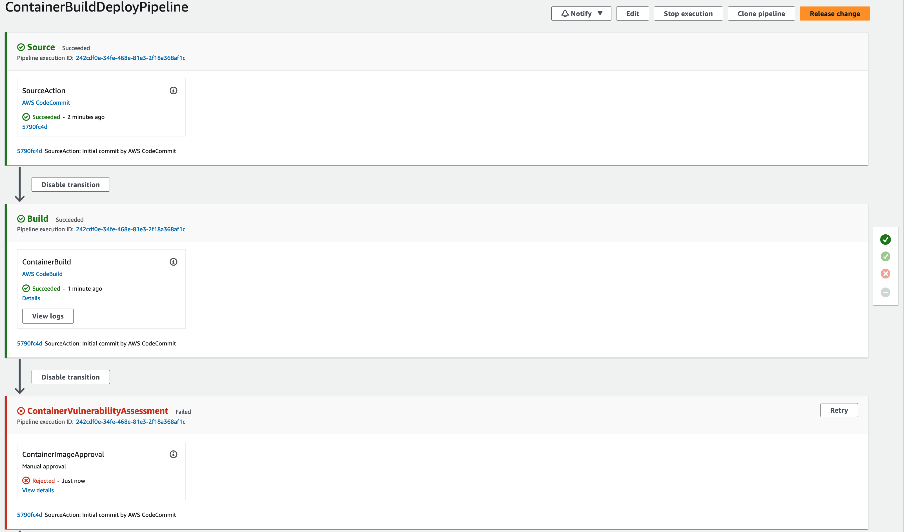
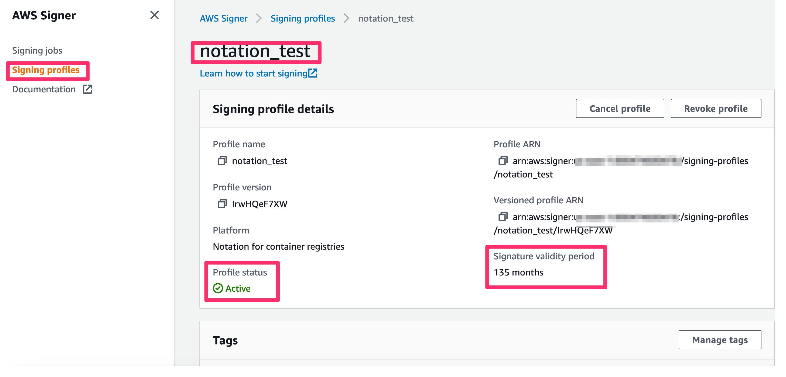

# Module: Image Security (ECR controls, Inspector CVE scanning, DevSecOps, image signing)

Securing the container-image supply chain for EKS: harden **Amazon ECR**, scan for CVEs
with **Amazon Inspector**, gate deployments with a **DevSecOps pipeline**, and enforce
**image signatures**. Pairs with the hands-on ECR controls in
[`command-log/commands/27-ecr-security-controls.md`](../command-log/commands/27-ecr-security-controls.md).

---

## 1. ECR security controls (done live — cmd 27)

| Control | What it does | Best practice |
|---------|--------------|---------------|
| **Scan on push** | ECR scans each pushed image for OS-package CVEs automatically. | Always on. Upgrade to Inspector **ENHANCED** scanning for deep + continuous scans. |
| **Immutable tags** | Prevents overwriting a tag (e.g. `:v1`) with different content. | Immutable = reproducible, anti supply-chain tampering. |
| **Encryption** | Images encrypted at rest (AES256 or KMS). | Use KMS for audited, customer-managed keys. |
| **Repository policy** | Resource-based policy: who can pull/push. | Least privilege — restrict to specific principals/accounts, not `*`. |
| **Lifecycle policy** | Auto-expire old/untagged images. | Reduce attack surface + cost; expire untagged, cap tagged count. |

### ECR policy evaluation logic (from `policy-evaluation-logic-short.png`)


ECR (like all IAM resource policies) evaluates: **explicit Deny wins first**, then it needs
an **explicit Allow** (identity- or resource-based); **no Allow = implicit deny**.
```
explicit Deny?  ── yes ─►  DENY
      │ no
explicit Allow? ── no ──►  DENY (implicit)
      │ yes
      ▼  ALLOW
```

---

## 2. Manage CVEs with Amazon Inspector (ENHANCED scanning)

- Switching ECR to **ENHANCED** scanning delegates scanning to **Amazon Inspector**, which
  provides deep OS + programming-language package vulnerability findings, **continuous**
  rescans as new CVEs are published, and severity + CVSS scoring.
- Findings flow to **Inspector** and can aggregate in **AWS Security Hub**.

> ⚠️ **Account-level enablement — flagged, not enabled.** Enabling Inspector /
> ENHANCED registry scanning is an **account-wide** change with **cost** implications
> (per-image + per-rescan). This repo documents it; enable only with explicit approval:
> `aws inspector2 enable --resource-types ECR` and
> `aws ecr put-registry-scanning-configuration --scan-type ENHANCED ...`.
> Verified current state (cmd 27): registry scan type = **BASIC**.

---

## 3. DevSecOps pipeline — gate deployments on scan results



The workshop's `devsecops/` Terraform builds a **CodePipeline** (this repo already contains
it). Flow (from `Inspector-pipeline.png`):

```
Source (CodeCommit) ─► Build (CodeBuild: build+push image to ECR)
   ─► ContainerVulnerabilityAssessment (Manual approval gated by Inspector scan)
   ─► Deploy (CodeBuild: kubectl deploy to EKS)
```

- An **EventBridge rule** routes the Inspector2 scan result to a **Lambda** that evaluates
  findings against **Critical/High/Medium thresholds** and **auto-approves or rejects** the
  pipeline's manual-approval stage (a DynamoDB table tracks the approval token).
- The screenshot shows `ContainerVulnerabilityAssessment → Rejected` when thresholds are
  breached — the image is **not deployed**.

> ⚠️ **Heavy provisioning + Inspector — flagged.** This creates CodeCommit/CodeBuild/
> CodePipeline/Lambda/DynamoDB/SNS/ECR/EventBridge and depends on Inspector being enabled.
> The Terraform is in [`devsecops/`](../devsecops/); apply only with explicit approval.
> See the full resource breakdown in [`ARCHITECTURE.md`](../ARCHITECTURE.md).

---

## 4. Image signing & verification (AWS Signer + Notation + Kyverno)

Guarantee only **signed, trusted** images run:



1. **AWS Signer** creates a **signing profile** (platform: "Notation for container
   registries") — see `aws-signer-profile.png` (`notation_test`, Active, validity period).
2. **Notation** (with the AWS Signer plugin) signs the image; the signature is stored in
   ECR alongside the image (OCI artifact).
3. **Kyverno** (admission policy engine) verifies the signature at admission — unsigned or
   untrusted images are **rejected**. The trust wiring is shown in
   `kyverno-notation-trust-wiring.svg`.

```
build image ─► AWS Signer signs (Notation) ─► signature pushed to ECR
   ─► on deploy, Kyverno verify-images checks signature against the trusted Signer profile
   ─► unsigned/untampered? admit ; else DENY
```

> Concept-only here (requires Signer profile + Kyverno install + signing keys). This is the
> supply-chain "who built this and is it untampered?" layer, complementing Inspector's
> "does it have known CVEs?".

---

## 5. Defense-in-depth summary for images

| Question | Control |
|----------|---------|
| Who can push/pull? | ECR **repository policy** (least privilege) |
| Can a tag be swapped? | ECR **immutable tags** |
| Does it have known CVEs? | ECR **scan-on-push** / **Inspector** ENHANCED |
| Are stale images pruned? | ECR **lifecycle policy** |
| Is deployment blocked on findings? | **DevSecOps pipeline** approval gate |
| Is the image authentic/untampered? | **AWS Signer + Notation + Kyverno** verification |

All together secure the image from build → registry → admission → runtime.
