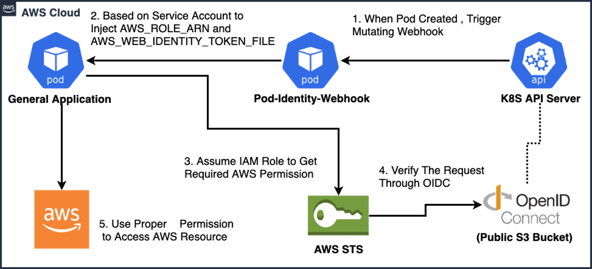
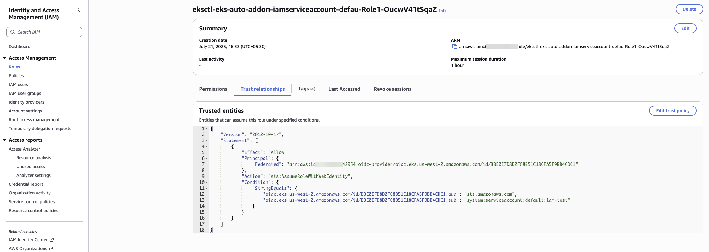
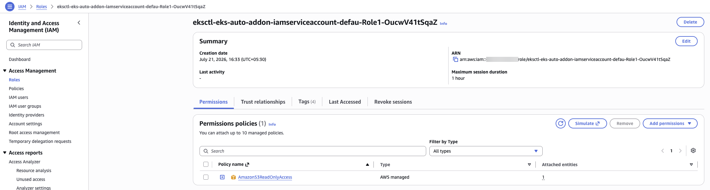
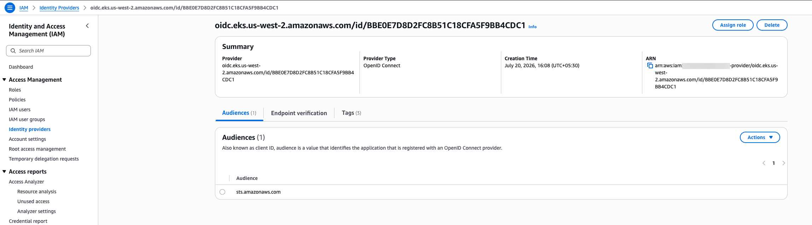
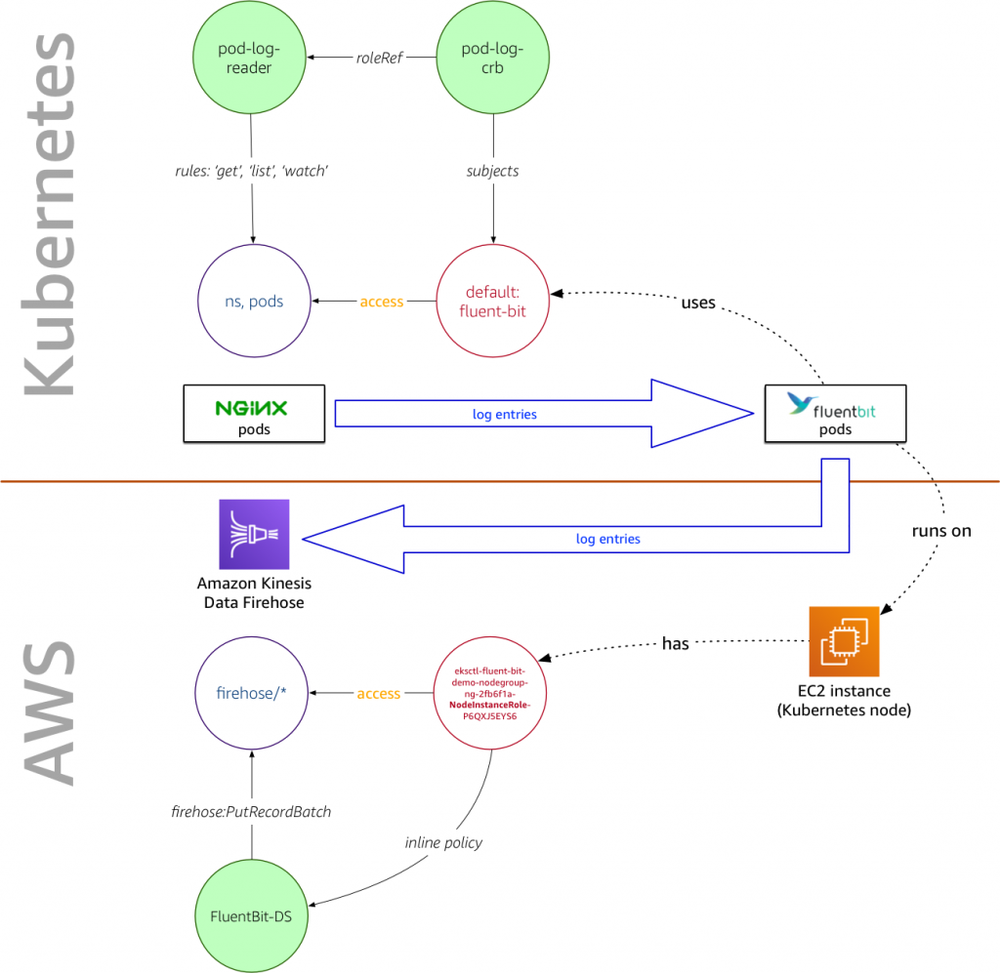

# IRSA — The Complete Flow (with diagram walkthrough)

This document explains the **full IRSA (IAM Roles for Service Accounts) flow end to end**,
walking through the five reference images in
`/Workshop/artifacts/images/iam/irsa/`. It complements the concepts in
[`irsa.md`](./irsa.md) and the hands-on demo
[`command-log/commands/13-irsa-nocredentials-demo.md`](../command-log/commands/13-irsa-nocredentials-demo.md).

Read this top-to-bottom: it goes **runtime flow → the two IAM pieces that make it work →
OIDC provider → RBAC-vs-IAM contrast**.

---

## Diagram 1 — `irsa.png` : the runtime credential flow (the heart of IRSA)




This diagram shows, step by step, how a pod gets AWS credentials at runtime. Everything
happens inside **AWS Cloud**, spanning the Kubernetes control plane and AWS STS.

```
                     1. Pod created, trigger
  General App  ◄──2──  Pod-Identity-Webhook  ◄──1──  K8S API Server
    (pod)                    (pod)                        (api)
      │                        ▲                            ┊
      │                        │                            ┊ 4. verify via OIDC
      │ 5. use creds           │ 3. AssumeRole              ▼
      ▼                        └──────────►  AWS STS ──►  OpenID Connect
   AWS service                                              (public bucket)
   (e.g. S3)
```

**The five steps in plain English:**

| Step | What happens | Why it matters |
|------|--------------|----------------|
| **1. When Pod is created, trigger mutating webhook** | The K8S **API Server** notifies the **EKS Pod Identity Webhook** (an admission mutating webhook) that a new pod is being created. | This is the automatic hook that makes IRSA "just work" — you don't edit the pod yourself. |
| **2. Based on the Service Account, inject `AWS_ROLE_ARN` and `AWS_WEB_IDENTITY_TOKEN_FILE`** | The webhook reads the pod's **ServiceAccount** annotation (`eks.amazonaws.com/role-arn`) and **mutates the pod spec**: it injects two env vars and mounts a **projected service-account token** (a signed JWT) into the container. | These two env vars are exactly what the AWS SDK/CLI looks for in its credential chain. `AWS_ROLE_ARN` = which role to assume; `AWS_WEB_IDENTITY_TOKEN_FILE` = path to the JWT proving the pod's identity. |
| **3. Assume IAM Role to get required AWS permission** | When the app calls AWS, the SDK reads those env vars and calls **STS `AssumeRoleWithWebIdentity`**, presenting the JWT. | This is where the pod *becomes* the IAM role — without any long-term keys. |
| **4. Verify the request through OIDC** | STS validates the JWT against the cluster's **OIDC provider** (whose public keys/discovery doc live at a public S3-backed endpoint). It also checks the role's **trust policy** conditions (`aud`, `sub`). | Cryptographic proof: only a genuinely-issued, unexpired token for the right ServiceAccount is accepted. No secret is shared. |
| **5. Use proper permission to access AWS resource** | STS returns **temporary credentials**; the app uses them to call the AWS service (e.g. list S3). | The pod now has *exactly* the role's permissions — least privilege, short-lived. |

> Key insight: the pod never holds a stored secret. It holds a **short-lived signed token**
> that STS exchanges for **short-lived credentials**. This is the whole security win.

---

## Diagram 2 — `iam-role-trust-policy.png` : WHO may assume the role (trust policy)




This is the IAM console **Trust relationships** tab of an IRSA role (an
`eksctl-...-iamserviceaccount-...-Role`). It answers **"who is allowed to assume this
role?"**

```json
{
  "Version": "2012-10-17",
  "Statement": [{
    "Effect": "Allow",
    "Principal": {
      "Federated": "arn:aws:iam::<ACCOUNT>:oidc-provider/oidc.eks.us-west-2.amazonaws.com/id/BBE0...CDC1"
    },
    "Action": "sts:AssumeRoleWithWebIdentity",
    "Condition": {
      "StringEquals": {
        "oidc.eks.us-west-2.amazonaws.com/id/BBE0...CDC1:aud": "sts.amazonaws.com",
        "oidc.eks.us-west-2.amazonaws.com/id/BBE0...CDC1:sub": "system:serviceaccount:default:iam-test"
      }
    }
  }]
}
```

**How to read it (this is the security-critical part):**

| Element | Meaning |
|---------|---------|
| `Principal.Federated = ...oidc-provider/...` | Only identities federated through **this specific cluster's OIDC provider** may assume the role. |
| `Action: sts:AssumeRoleWithWebIdentity` | The web-identity (OIDC/JWT) assume-role action — matches step 3/4 in Diagram 1. |
| `Condition ...:aud = sts.amazonaws.com` | The token's **audience** must be STS (prevents tokens minted for another audience from working). |
| `Condition ...:sub = system:serviceaccount:default:iam-test` | The token's **subject** must be **exactly** the ServiceAccount `iam-test` in the `default` namespace. |

> This `sub` condition is what makes IRSA **least-privilege and pod-scoped**: only pods
> using the `default/iam-test` ServiceAccount can assume this role. Change the SA or
> namespace and STS refuses. **This is the single most important line to get right.**

---

## Diagram 3 — `iam-role-permissions.png` : WHAT the role can do (permissions policy)




The **Permissions** tab of the same role. Here it has a single managed policy:

```
Permissions policies (1)
  Policy name            Type          
  AmazonS3ReadOnlyAccess  AWS managed   
```

- The **trust policy** (Diagram 2) said *who* can become the role.
- The **permissions policy** (this one) says *what* the role can do once assumed — here,
  **read-only S3**.

Together they answer the two IAM questions separately and cleanly:
**"who may assume"** (trust) vs. **"what may they do"** (permissions).

> For our earlier failing demo (`aws s3 ls`), attaching `AmazonS3ReadOnlyAccess` to the
> role — and pointing the pod's ServiceAccount at it — is exactly what turns
> `NoCredentials` into a successful bucket listing.

---

## Diagram 4 — `oidc.png` : the IAM OIDC identity provider (the trust anchor)




The IAM console **Identity providers** view showing the cluster's OIDC provider:

| Field | Value (example) | Meaning |
|-------|-----------------|---------|
| **Provider** | `oidc.eks.us-west-2.amazonaws.com/id/BBE0...CDC1` | The cluster's unique OIDC issuer URL. |
| **Provider Type** | OpenID Connect | It's an OIDC federation provider. |
| **Audience** | `sts.amazonaws.com` | The client ID tokens are minted for — matches the `aud` condition in the trust policy. |
| **ARN** | `arn:aws:iam::<ACCOUNT>:oidc-provider/oidc.eks...` | What the role trust policy references as `Principal.Federated`. |

**Why this exists:** registering the cluster's OIDC issuer as an IAM identity provider is
what lets **STS trust tokens the cluster signs**. Without it, step 4 in Diagram 1 (OIDC
verification) has nothing to verify against, and `AssumeRoleWithWebIdentity` fails. This
is procedure #1 of "Enabling IRSA."

> On **EKS Pod Identity** (the newer mechanism) you do **not** need this per-cluster OIDC
> provider — that's one of its main simplifications. IRSA requires it.

---

## Diagram 5 — `iam-rbac-example-1024x997.png` : RBAC (Kubernetes) vs. IAM (AWS), side by side




This diagram contrasts the **two independent permission systems** a pod uses, using a
Fluent Bit log-shipping example. A horizontal line splits **Kubernetes** (top) from
**AWS** (bottom).

**Top half — Kubernetes RBAC (access to *Kubernetes* resources):**
```
pod-log-crb (ClusterRoleBinding) --roleRef--> pod-log-reader (ClusterRole: get/list/watch)
        │ subjects                                     │ rules
        ▼                                              ▼
  default:fluent-bit (ServiceAccount) --access--> ns, pods
  (fluent-bit pods use this SA to READ pod logs; nginx pods emit log entries)
```

**Bottom half — AWS IAM (access to *AWS* services):**
```
EC2 instance (node) --has--> NodeInstanceRole --access--> firehose/*
                                     │ inline policy (firehose:PutRecordBatch)
                                     ▼
                              FluentBit-DS --> Amazon Kinesis Data Firehose
```

**The lesson of this diagram:**

| System | Governs | Example here |
|--------|---------|--------------|
| **Kubernetes RBAC** (top) | What the pod can do to **Kubernetes** objects | fluent-bit's ServiceAccount may `get/list/watch` pods & namespaces to read logs. |
| **AWS IAM** (bottom) | What the workload can do to **AWS** services | permission to `firehose:PutRecordBatch` into Kinesis Data Firehose. |

> **Important contrast — and the reason IRSA matters:** in *this* older example the AWS
> permission comes from the **NodeInstanceRole** (the EC2 node's role). That means **every
> pod on the node** inherits `firehose` access — the exact anti-pattern IRSA fixes. With
> IRSA, that bottom-half arrow would instead come from a **pod-scoped role** bound to the
> fluent-bit **ServiceAccount** (via the trust policy in Diagram 2), so only fluent-bit —
> not every pod on the node — can write to Firehose.

---

## Putting it all together — the full IRSA lifecycle

```
SETUP (once):
  (D4) Register cluster OIDC issuer as an IAM OIDC provider
  (D3) Create IAM role with a permissions policy (e.g. AmazonS3ReadOnlyAccess)
  (D2) Set the role's trust policy: Federated=OIDC provider,
        Action=AssumeRoleWithWebIdentity, Condition sub=system:serviceaccount:<ns>:<sa>
  Annotate the Kubernetes ServiceAccount with eks.amazonaws.com/role-arn=<role ARN>

RUNTIME (every pod using that SA — Diagram 1):
  1. Pod created  → API server triggers the Pod Identity mutating webhook
  2. Webhook injects AWS_ROLE_ARN + AWS_WEB_IDENTITY_TOKEN_FILE (projected JWT)
  3. App's SDK calls STS AssumeRoleWithWebIdentity with the JWT
  4. STS verifies the JWT via the OIDC provider + checks trust-policy aud/sub
  5. STS returns temporary creds → app calls the AWS service with least-privilege access
```

**One-line summary:** IRSA gives each **pod** (via its **ServiceAccount**) its own
**short-lived, least-privilege AWS identity** — proven by an **OIDC-signed token** and
scoped by the role's **trust policy `sub` condition** — instead of every pod silently
sharing the node's IAM permissions.

---

## Image reference

| Diagram | File | Shows |
|---------|------|-------|
| 1 | `iam/irsa/irsa.png` | Runtime credential flow (webhook → env vars → STS → OIDC → AWS). |
| 2 | `iam/irsa/iam-role-trust-policy.png` | Role **trust policy** — who may assume (OIDC `aud`/`sub`). |
| 3 | `iam/irsa/iam-role-permissions.png` | Role **permissions** — what it can do (AmazonS3ReadOnlyAccess). |
| 4 | `iam/irsa/oidc.png` | The IAM **OIDC identity provider** (trust anchor). |
| 5 | `iam/irsa/iam-rbac-example-1024x997.png` | **RBAC vs. IAM** — Kubernetes access vs. AWS access. |
