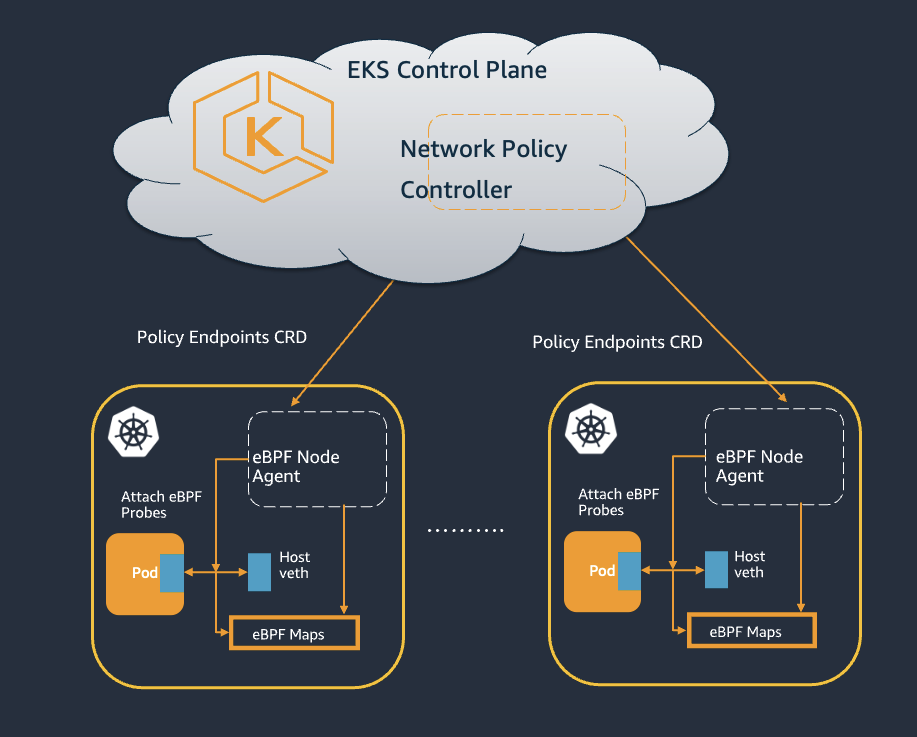
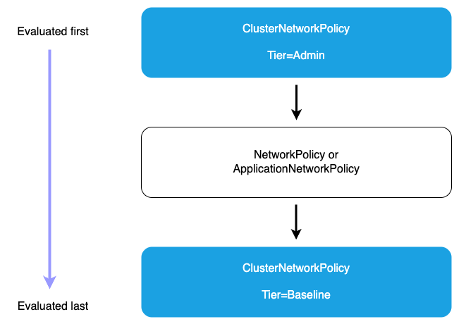

# Module: Network Security — Kubernetes Network Policies (EKS Auto Mode)

Control pod-to-pod (and pod-to-external) traffic at L3/L4 using **Kubernetes
NetworkPolicies**, enforced on EKS by the **Amazon VPC CNI Network Policy Controller** +
**eBPF node agent**. Pairs with the hands-on demo in
[`command-log/commands/25-network-policies.md`](../command-log/commands/25-network-policies.md).

---

## 1. What NetworkPolicies do

By default Kubernetes allows **all** pod-to-pod traffic. A **NetworkPolicy** selects pods
(`podSelector`) and restricts their **ingress**/**egress** to only what you allow. Use
cases: segment workloads so only related apps talk; isolate tenants per namespace.

> **Fail-safe model:** once *any* policy selects a pod for a direction, that pod becomes
> **default-deny** for that direction except what the policy explicitly allows.

---

## 2. How enforcement works on EKS (from `vpc_cni_policy.png`)



```
        EKS Control Plane
   ┌──────────────────────────────┐
   │  Network Policy Controller    │  watches NetworkPolicy objects,
   └──────────────┬───────────────┘  reconciles them into PolicyEndpoints (CRD)
                  │ PolicyEndpoints CRD
        ┌─────────▼─────────┐   (per node)
        │  eBPF Node Agent   │  attaches eBPF probes to each Pod's veth,
        │  → eBPF Maps       │  programs allow/deny rules from PolicyEndpoints
        └────────────────────┘
```

- The **controller** (control plane) turns each `NetworkPolicy` into **`PolicyEndpoints`**
  objects listing the target pods and the allowed source CIDRs.
- The **eBPF node agent** reads those and programs **eBPF maps** on each node, filtering at
  the pod's veth interface. High-performance, no sidecar.

---

## 3. Policy evaluation order (from `policy-evaluation-order.png`)



EKS supports tiered policies, evaluated in this order:

```
1. ClusterNetworkPolicy  Tier=Admin      (evaluated FIRST; Deny wins, cannot be overridden)
2. NetworkPolicy / ApplicationNetworkPolicy   (namespace-scoped; can only further restrict)
3. ClusterNetworkPolicy  Tier=Baseline   (evaluated LAST; org-wide defaults, overridable)
4. Default deny          (if nothing matched)
```

- **Admin Deny** = highest precedence, org-wide, cannot be overridden by namespace policies.
- **Admin Allow / Pass** = allow short-circuits; pass delegates to the NetworkPolicy tier.
- **Baseline** = default posture teams *can* override.

EKS also adds **DNS-based egress** filtering and the **ApplicationNetworkPolicy** CRD
(standard NetworkPolicy fields + FQDN egress filtering) for L7 domain allow-listing.

---

## 4. ⚠️ Enabling network policy on EKS Auto Mode (the critical setup)

This is **not on by default** and has **two** requirements (learned the hard way — see the
command log):

1. **Enable the Network Policy Controller** via a ConfigMap:
   ```yaml
   apiVersion: v1
   kind: ConfigMap
   metadata: { name: amazon-vpc-cni, namespace: kube-system }
   data: { enable-network-policy-controller: "true" }
   ```
2. **NodeClass `networkPolicy`** setting controls the *default* agent posture:
   - `DefaultAllow` (the Auto Mode default) — pods reachable unless a policy denies.
   - `DefaultDeny` — pods isolated unless a policy allows (stronger; recommended for
     least-privilege).
   Set via `kubectl patch nodeclass default -p '{"spec":{"networkPolicy":"DefaultDeny"}}'`.
   Optionally `networkPolicyEventLogs: Enabled`.

> **Gotcha we hit:** the node's eBPF agent picks up the controller-enabled state **at node
> start**. If you enable the ConfigMap *after* nodes are running, allow-rules won't program
> until the node is **recycled** (Auto Mode rolls a fresh node). PolicyEndpoints appear in
> the control plane, but eBPF on the stale node won't enforce the allows until it restarts.

---

## 5. Best practices

- **Deny by default** (`DefaultDeny` or an explicit deny-all), then add least-privilege
  allow rules — "explicitly justify each connection".
- Remember to **allow egress to CoreDNS** (port 53) when using egress policies, or DNS
  breaks. CoreDNS IP = the `.10` of the cluster service CIDR (fixed for the cluster's life).
- Use **Admin ClusterNetworkPolicy** for org-wide guardrails that teams can't override.
- Prefer **specific FQDNs** over broad wildcards in DNS-based egress rules.
- Test in staging that mirrors prod; monitor after changes; have a rollback (patch back to
  `DefaultAllow`).

---

## 6. Relation to the rest of the workshop

- Network policy is the **east-west traffic** control layer; it complements
  RBAC/access-entries (API access), IRSA/Pod Identity (AWS access), and PSA/Gatekeeper
  (workload config) for defense in depth.
- The workshop's other network-security modules build on this: **VPC Lattice** (L7 service
  access across clusters/VPCs) and **mTLS with ALB** (transport-level identity).
