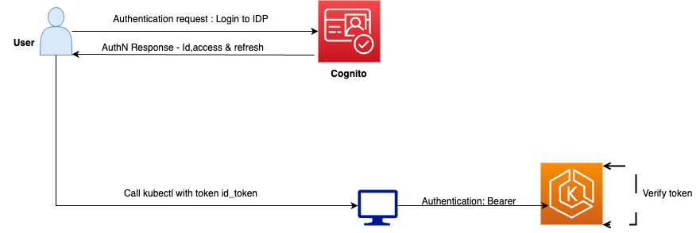
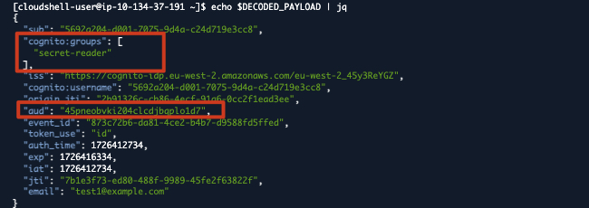
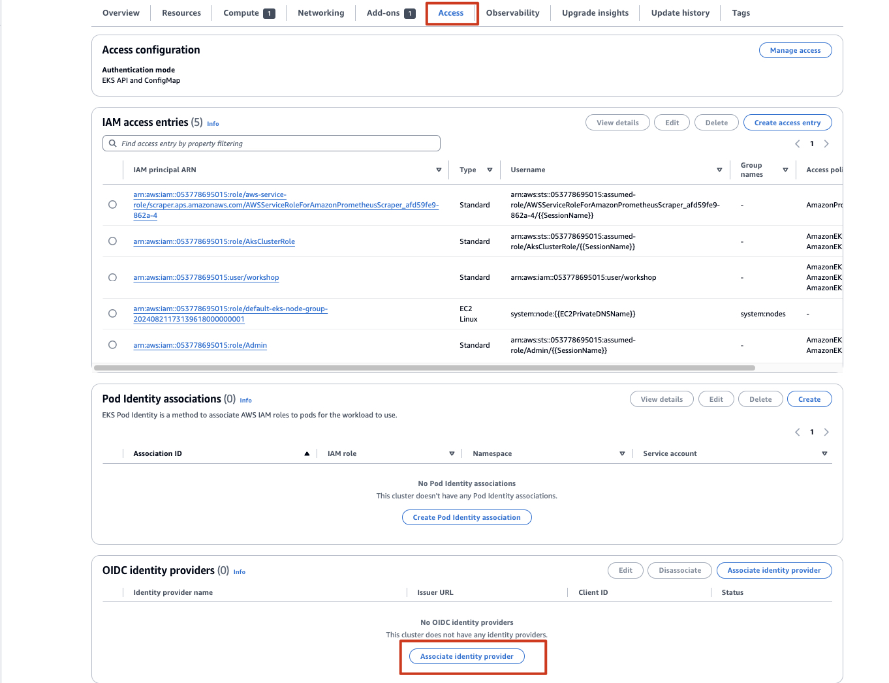

# Module: OIDC Identity Provider Authentication for Amazon EKS

This module covers the **third** EKS cluster-access mechanism (after `aws-auth` and access
entries): authenticating **human users** via your own **OpenID Connect (OIDC) identity
provider** (e.g. Amazon Cognito, Okta, Keycloak, Azure AD) instead of AWS IAM.

> This is largely a **concept + console** module — associating an OIDC IdP requires an
> external IdP (a Cognito user pool with users/groups) and console/CLI association. In this
> environment no user-auth OIDC IdP is associated (verified below); this doc explains the
> architecture and flow so it can be reproduced. Concept map:
> [`iam-and-eks-access.md`](./iam-and-eks-access.md) (the three mechanisms).

---

## 1. Don't confuse the two "OIDC" in EKS

| "OIDC" | Purpose | Direction |
|--------|---------|-----------|
| **Cluster OIDC issuer** (IRSA) | Lets **pods** get AWS credentials | Kubernetes → **AWS** (STS) |
| **OIDC identity provider** (this module) | Lets **human users** authenticate to the cluster | External IdP → **Kubernetes API server** |

They both use OIDC/JWTs but solve **opposite** problems. This module is about the second:
**user authentication** to `kubectl`.

Verified in this environment:
```
aws eks list-identity-provider-configs --cluster-name eks-auto  ->  []   (no user-auth IdP associated)
aws eks describe-cluster ... identity.oidc.issuer  ->  https://oidc.eks.us-west-2.amazonaws.com/id/5CC1...  (the IRSA issuer, different thing)
```

---

## 2. Why authenticate users with an external OIDC IdP?

- **No IAM user/role per person.** Users live in your IdP (Cognito/Okta/etc.), not IAM.
- **Central identity & SSO** — reuse the same corporate login, MFA, password policies.
- **Group-based RBAC** — the IdP puts the user's **groups** in a token claim; Kubernetes
  RBAC binds those groups to Roles. Add/remove a user from an IdP group to change access.
- Ideal when your org already standardizes on an IdP and doesn't want to manage IAM
  identities for cluster access.

> Contrast: IAM principals (access entries / `aws-auth`) can *also* use the EKS API/CLI;
> OIDC users can **only** work with **Kubernetes objects**, not the EKS AWS API.

---

## 3. The authentication flow (from `OIDC-authentication-architecture.png`)



```
        1. Login (authentication request)
  User ───────────────────────────────►  Cognito (OIDC IdP)
       ◄───────────────────────────────
        2. AuthN response: id_token, access_token, refresh_token

        3. kubectl call with id_token
  User ───────────────────────────────►  (IDE / kubectl)
                                            │  Authorization: Bearer <id_token>
                                            ▼
                                        EKS API server ── 4. verify token ──► (validates against IdP)
```

1. The user logs in to the **OIDC IdP** (here **Amazon Cognito**).
2. The IdP returns an **`id_token`** (a JWT), plus access/refresh tokens.
3. The user runs `kubectl`, which sends the `id_token` as a **Bearer** token.
4. The **EKS API server** validates the token against the associated OIDC provider
   (issuer, audience, signature, expiry) and extracts the **username** and **groups**
   claims for authorization.

---

## 4. The token's group claim (from `oidc-eks-cognito-groupclaim.jpg`)



A decoded Cognito `id_token` payload includes:
```jsonc
{
  "sub": "5692a204-...",
  "cognito:groups": [ "secret-reader" ],     // <-- the GROUP claim used for RBAC
  "iss": "https://cognito-idp.<region>.amazonaws.com/<user-pool-id>",
  "aud": "45pneobvki2...",                    // the app client ID (audience)
  "cognito:username": "5692a204-...",
  "token_use": "id",
  "email": "test1@example.com",
  ...
}
```

- **`cognito:groups`** → mapped to Kubernetes **groups** in the IdP association
  (`--groups-claim cognito:groups`). RBAC then binds e.g. group `secret-reader` to a Role
  that can read Secrets.
- **`iss`** → must match the associated provider's issuer URL.
- **`aud`** → the app client ID; must match the association's client ID.

---

## 5. How to associate an OIDC IdP (from `oidc-eks-access-associateidp.jpg`)



In the **EKS Console → Access tab → OIDC identity providers → Associate identity
provider** (or via CLI):

```bash
aws eks associate-identity-provider-config \
  --cluster-name eks-auto \
  --oidc identityProviderConfigName=cognito,\
issuerUrl=https://cognito-idp.<region>.amazonaws.com/<user-pool-id>,\
clientId=<app-client-id>,\
usernameClaim=email,\
groupsClaim=cognito:groups
```

Key parameters:
| Parameter | Meaning |
|-----------|---------|
| `issuerUrl` | The IdP's OIDC issuer (the token `iss`). |
| `clientId` | The app client ID (the token `aud`). |
| `usernameClaim` | Which claim becomes the Kubernetes username (e.g. `email`). |
| `groupsClaim` | Which claim becomes Kubernetes groups (e.g. `cognito:groups`). |

Then bind those groups with **RBAC**, e.g.:
```yaml
kind: RoleBinding            # or ClusterRoleBinding
subjects:
- kind: Group
  name: secret-reader        # matches a value from cognito:groups
roleRef:
  kind: ClusterRole
  name: view
```

---

## 6. Setup summary (Cognito path, per the oidc-cognito images)

1. **Create a Cognito user pool** (sign-in options, security requirements, message
   delivery, app client).
2. **Create groups** (e.g. `secret-reader`) and **create users**, add users to groups.
3. Note the **issuer URL** (user pool) and **app client ID**.
4. **Associate the OIDC IdP** with the EKS cluster (console Access tab or CLI above).
5. Author **RBAC** binding the group claim to Roles/ClusterRoles.
6. User obtains an `id_token` from Cognito and configures `kubectl` to send it; the API
   server authenticates them and RBAC authorizes based on their groups.

---

## 7. Auditability

The oidc-cognito images include CloudWatch/Control-plane **audit** views
(`oidc-eks-user-secrets-audit.png`, `oidc-eks-user-nodes-audit.png`,
`oidc-eks-observability-cloudwatch-audit.png`): with control-plane **audit logging**
enabled, API requests made by an OIDC user appear in the EKS audit log — you can trace,
for example, an OIDC user in group `secret-reader` reading a Secret. (Our cluster
pre-enables `audit` logging — see the root `main.tf` `cluster_enabled_log_types`.)

---

## 8. When to use which cluster-access mechanism (recap)

| Mechanism | Best for |
|-----------|----------|
| **Access entries** | Modern default for **IAM** principals on new clusters / Auto Mode. |
| **`aws-auth` ConfigMap** | Legacy IAM-principal mapping on existing clusters. |
| **OIDC identity provider** | **Human users** authenticated by an external IdP (Cognito/Okta/…), group-based RBAC, no per-user IAM. |

> Limitation: an OIDC user identity **cannot** be granted IAM permissions to use the EKS
> AWS API/CLI/Console — it only works with Kubernetes objects via `kubectl`.
