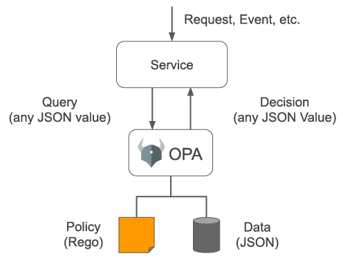
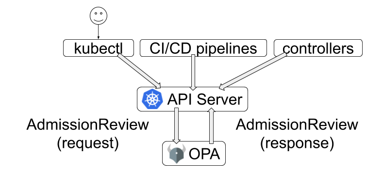

# Module: Pod Security — OPA / Gatekeeper (policy-based admission control)

Beyond the built-in Pod Security Admission (PSS/PSA), you can enforce **arbitrary custom
policies** at admission time with **Open Policy Agent (OPA)** and its Kubernetes-native
project **Gatekeeper**. Pairs with the hands-on demo in
[`command-log/commands/24-opa-gatekeeper.md`](../command-log/commands/24-opa-gatekeeper.md).

> Where this fits: PSA ([`pod-security-pss-psa.md`](./pod-security-pss-psa.md)) enforces the
> 3 fixed Pod Security Standards. **OPA/Gatekeeper** enforces **your own rules** — required
> labels, allowed image registries, banned settings, naming conventions, etc.

---

## 1. What is OPA? (from `opa-service.png`)



**Open Policy Agent (OPA)** is a general-purpose **policy engine**. A service sends OPA a
**query** (any JSON), OPA evaluates it against a **policy written in Rego** plus optional
**data (JSON)**, and returns a **decision** (any JSON).

```
Request/Event ──► Service ──query(JSON)──► OPA ──► decision(JSON)
                                            │
                                   Policy (Rego) + Data (JSON)
```

OPA is not Kubernetes-specific — it's used for microservice authz, CI/CD gates, etc. In
Kubernetes we use it via **Gatekeeper**.

---

## 2. How Gatekeeper plugs into Kubernetes (from `kubernetes-admission-flow.png`)



Gatekeeper runs as a **validating (and mutating) admission webhook**. Every write request
— whether from `kubectl`, **CI/CD pipelines**, or **controllers** — hits the API server,
which sends an **AdmissionReview (request)** to OPA/Gatekeeper and gets back an
**AdmissionReview (response)** that allows or denies it.

```
kubectl / CI-CD / controllers ──► API Server ──AdmissionReview(request)──► OPA/Gatekeeper
                                             ◄──AdmissionReview(response)──
```

Because it sits at **admission**, a denied object is **never created** — the same choke
point PSA uses, but programmable.

---

## 3. The two Gatekeeper objects

| Object | Analogy | What it is |
|--------|---------|-----------|
| **ConstraintTemplate** | a **class** | Defines a new policy *kind* + the **Rego** logic (the rule). Registers a new CRD. |
| **Constraint** | an **instance** | Instantiates a template: says *where* it applies (`match`: kinds/namespaces) and any parameters. |

So you write the rule **once** (template) and apply it **many times** with different scopes
(constraints).

---

## 4. Example: deny privileged containers

**ConstraintTemplate** (Rego rule):
```rego
package k8spspprivileged
violation[{"msg": msg}] {
  c := input.review.object.spec.containers[_]
  c.securityContext.privileged
  msg := sprintf("Privileged container is not allowed: %v ...", [c.name])
}
```
**Constraint** (apply to Pods in a namespace):
```yaml
kind: K8sPSPPrivilegedContainer
metadata: { name: psp-privileged-container }
spec:
  match:
    kinds: [{ apiGroups: [""], kinds: ["Pod"] }]
    namespaces: ["opa-test"]
```

A privileged pod is then rejected with (matches the workshop screenshot):
```
Error from server (Forbidden): admission webhook "validation.gatekeeper.sh" denied the request:
[psp-privileged-container] Privileged container is not allowed: nginx, securityContext: {"privileged": true}
```

---

## 5. Enforcement modes & audit

- **`enforcementAction`** on a Constraint: `deny` (default, block), `dryrun` (log only), or
  `warn` (allow + warning).
- **Audit**: Gatekeeper's audit pod periodically re-checks **existing** objects against
  constraints and records `status.totalViolations` — so you can find pre-existing
  violators, not just block new ones.

---

## 6. OPA/Gatekeeper vs. PSA — when to use which

| | PSA (built-in) | OPA/Gatekeeper |
|-|----------------|----------------|
| Rules | Fixed 3 PSS levels | **Any** custom rule (Rego) |
| Install | None (built in) | Deploy Gatekeeper (Helm) |
| Scope | Namespace labels | Flexible `match` (kinds/namespaces/labels) |
| Examples | non-root, drop caps, seccomp | required labels, allowed registries, naming, replica limits, block `:latest`, … |
| Mutation | No | Yes (Assign/AssignMetadata) |

Best practice: use **PSA** for the standard baseline/restricted posture, and **Gatekeeper
(or Kyverno)** for organization-specific rules PSA can't express. They complement each
other. (Kyverno appears elsewhere in this workshop for image-signature verification.)

---

## 7. Relation to the rest of the workshop

- Same **admission choke point** as PSA — layered with RBAC/access-entries (who) and
  IRSA/Pod Identity (what AWS).
- The **image-security** module uses **Kyverno** (a similar policy engine) to verify image
  signatures — see `image-security/kyverno-notation-trust-wiring.svg`.
