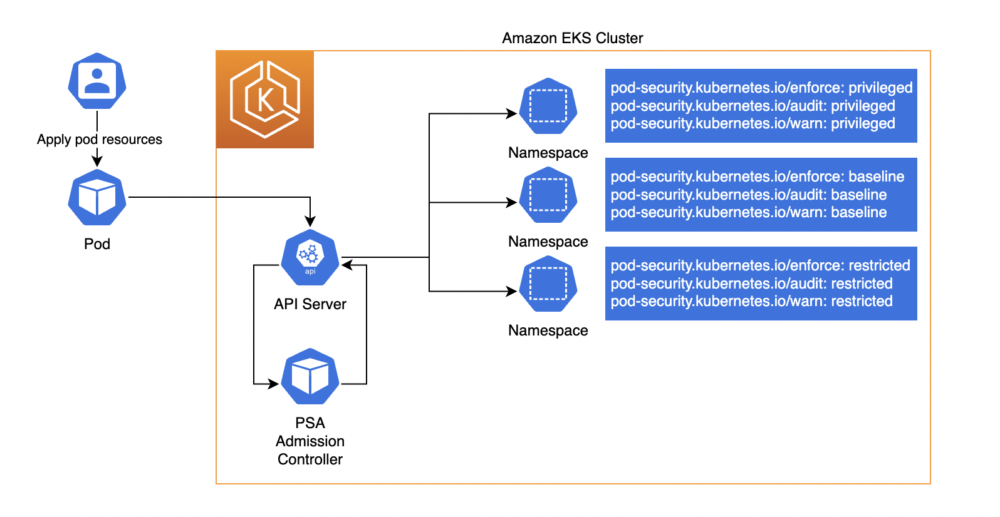
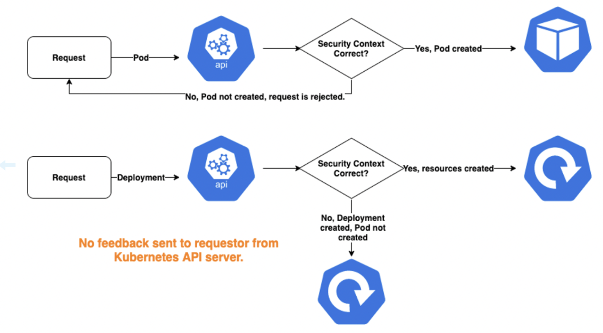

# Module: Pod Security — Pod Security Standards (PSS) & Pod Security Admission (PSA)

How Kubernetes enforces pod-level security posture natively — via **Pod Security Standards
(PSS)** applied by the built-in **Pod Security Admission (PSA)** controller. Pairs with the
hands-on demo in
[`command-log/commands/23-pod-security-pss-psa.md`](../command-log/commands/23-pod-security-pss-psa.md).

---

## 1. Two concepts

- **Pod Security Standards (PSS)** — three predefined **policy levels** describing how
  hardened a pod must be:
  | Level | Meaning |
  |-------|---------|
  | **privileged** | Unrestricted — anything goes (no limits). |
  | **baseline** | Blocks known privilege escalations; minimally restrictive. |
  | **restricted** | Heavily hardened, follows current pod-security best practice (non-root, drop ALL caps, seccomp RuntimeDefault, no privilege escalation, …). |

- **Pod Security Admission (PSA)** — the **built-in admission controller** (enabled by
  default on Kubernetes ≥1.25, including EKS) that enforces a PSS level on a **namespace**
  based on that namespace's **labels**.

> PSA replaced the removed **PodSecurityPolicy (PSP)**. It's built in — nothing to install.

---

## 2. How PSA works (from `k8s-psa-pss.png`)



```
User applies pod ──► Pod ──► API Server ──► PSA Admission Controller
                                               │  checks the target namespace's labels
                                               ▼
   Namespace labels decide the outcome:
     pod-security.kubernetes.io/enforce: <level>
     pod-security.kubernetes.io/audit:   <level>
     pod-security.kubernetes.io/warn:    <level>
```

You label each **namespace** with up to **three modes**, each set to a **level**
(privileged/baseline/restricted):

| Mode label | Effect when a pod violates the level |
|------------|--------------------------------------|
| **`enforce`** | **Reject** the pod (it is not created). |
| **`audit`** | **Allow**, but record a violation annotation in the **audit log**. |
| **`warn`** | **Allow**, but return a **warning** to the user/client. |

You can combine them — e.g. `enforce: baseline` + `warn/audit: restricted` to hard-block
baseline violations while nudging teams toward restricted.

Example labels (per the diagram):
```yaml
pod-security.kubernetes.io/enforce: restricted
pod-security.kubernetes.io/audit:   restricted
pod-security.kubernetes.io/warn:    restricted
```

---

## 3. ⚠️ The PSA UX gotcha (from `psa-ux-issues.png`)



**`enforce` only acts on the Pod object itself.** This matters for controllers:

- **Apply a Pod directly** → PSA checks it immediately. If the security context is wrong,
  the **request is rejected** and the user sees the error. ✅ Clear feedback.
- **Apply a Deployment** (or other controller) → the **Deployment/ReplicaSet is created
  successfully** (the controller object passes), but when it tries to create the **Pods**,
  those are rejected — and **no feedback is sent back to the requestor** from the API
  server. The Deployment just shows 0 ready replicas with no obvious error.

**Implication:** rely on **`warn`** (and `audit`) — not just `enforce` — so that applying a
non-compliant **Deployment** still surfaces a visible warning at apply time. This is why
best practice sets `warn`/`audit` alongside `enforce`.

---

## 4. Best practices

- Set a **cluster-wide safe default** (e.g. baseline) and **tighten specific namespaces**
  to `restricted`.
- Always pair `enforce` with `warn` + `audit` at the **same or stricter** level so
  controller-created workloads surface violations.
- Exempt only what must be privileged (e.g. `kube-system`) — never blanket-privileged.
- Combine PSA with admission policy engines (OPA/Gatekeeper, Kyverno — see the `opa`
  images) for rules PSS doesn't cover (image registries, required labels, etc.).
- A **restricted**-compliant pod typically needs:
  ```yaml
  securityContext:
    runAsNonRoot: true
    runAsUser: 1000
    allowPrivilegeEscalation: false
    capabilities: { drop: ["ALL"] }
    seccompProfile: { type: RuntimeDefault }
  ```

---

## 5. Relation to the rest of the workshop

- PSA governs **what a pod may be** (security context) at admission; **RBAC/access
  entries** govern **who may create it**; **IRSA/Pod Identity** govern **what AWS it can
  reach**. Layered defense.
- On **EKS Auto Mode**, PSA is available out of the box; you just label namespaces.
